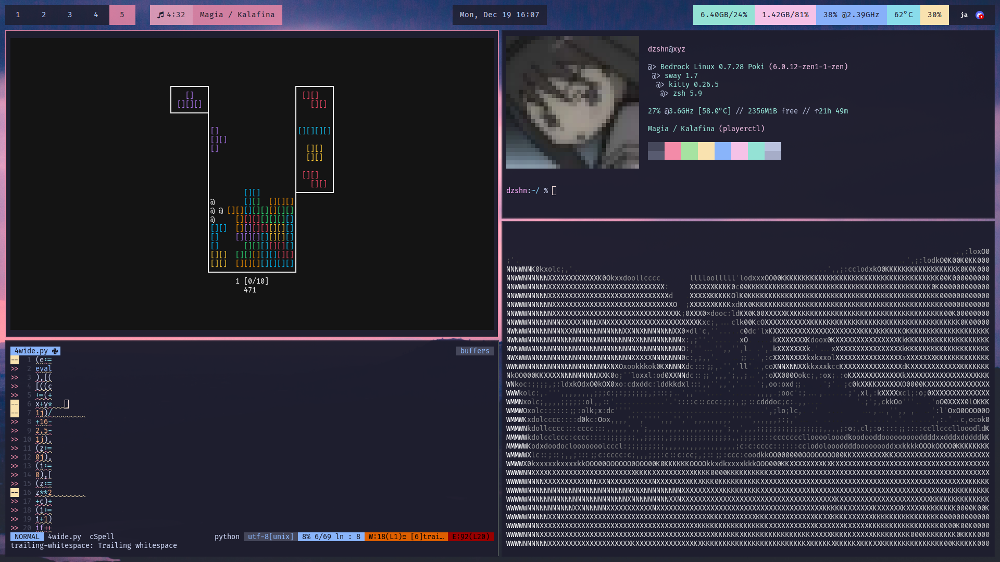
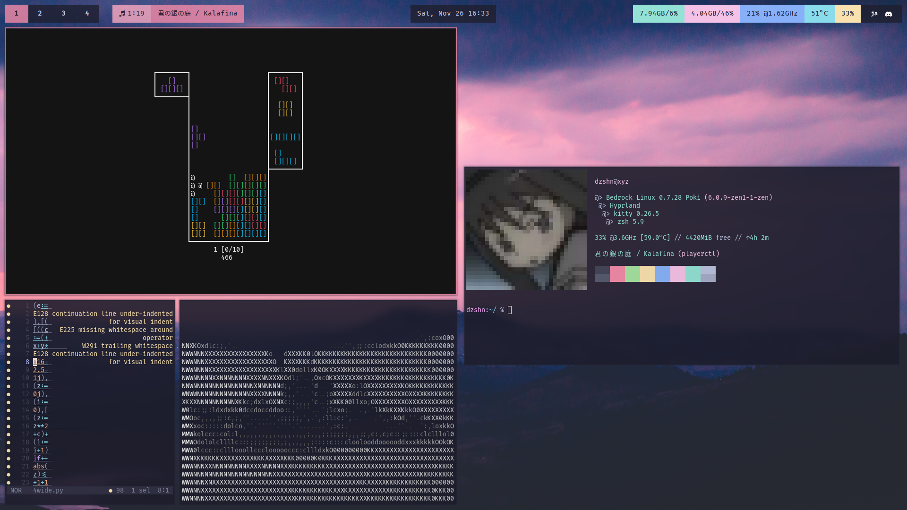

# ~/.*

**Sway:**

**Hyprland:**

in images:

- [python-tetris's cli](https://github.com/dzshn/python-tetris/tree/v1) (I made that!)
- editor: [helix](https://github.com/helix-editor/helix) on 1st screenshot, nvim on 2nd (dont mind the code)
- terminal: [kitty](https://github.com/kovidgoyal/kitty)
- ascii image displayed by [jp2a](https://github.com/Talinx/jp2a)
- wayland compositor: [hyprland](https://github.com/hyprwm/Hyprland)
- bar: [waybar](https://github.com/Alexays/Waybar)
- shell: [zsh](https://www.zsh.org/) with [omz](https://github.com/ohmyzsh/ohmyzsh/)
- background: [unsplash photo by @jdiegoph](https://unsplash.com/photos/YVSDD8ndlP8)
- palette: [catppuccin](https://github.com/catppuccin/catppuccin)
- i use arch btw (hijacked with [bedrock linux](https://bedrocklinux.org/))
